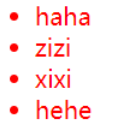
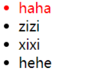
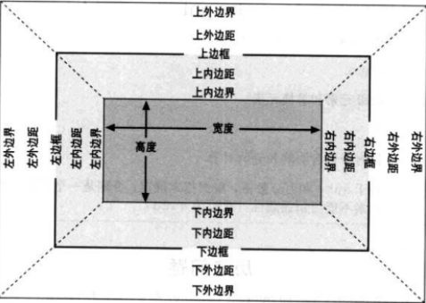
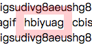
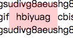

# CSS和文档    
### 替换和非替换元素      
**替换元素**：是指用来替换元素内容的部分并非由文档内容直接表示，如img和input。    
**非替换元素**：是指其内容由用户代理（通常是浏览器）在元素本身生成的框中显示。如段落、标题、列表和表单元格等。     
      
### 块级元素和行内元素     
**块级元素**：块级元素生成一个行内框，（默认的）它会填充父元素的内容区，旁边不能有其他元素。列表项是块级元素的一个特例，它会生成一个标记符，无序列表是一个圆点，有序列表是一个数字。     
**行内元素**：行内元素在一个文本行内生成元素框，而不会打断这行文本。     
在HTML和XHTML中，块级元素不能嵌套在行内元素中，而CSS中没有这种限制。       
        
## 在HTML中使用CSS    
* link标记，称为外部样式表。     
* style元素，称为内部样式表或嵌套样式表。    
* @import    
* 内联样式    

CSS注释用/* */包裹。    
     
         
# 选择器    
### 元素选择器    
### 类选择器     
```
    /*p和warning中间没有空格，这个样式会应用到class为warning的p元素*/
    p.warning {color:red};
```
### ID选择器     
### 属性选择器，有四种类型    
1. 简单属性选择器    
```
    /*选择所有有class属性的p元素，将其文本置为银色*/
    p[class] { color:silver; }

    /*选择所有有class和id属性的p元素，将其文本置为银色*/
    p[class][id] { color:silver; }
```
2. 根据具体属性值选择    
```
    /*选择所有title属性值为w3c的p元素，将其文本置为银色*/
    p[title="w3c"] { color:silver; }
```
3. 根据部分属性值选择    
```
    /*选择所有class属性包含warn的p元素，将其文本置为红色*/
    /*包括class="warn danger"，不包括class="warning "*/
    p[class~="warn"] { color:red; }
```
子串匹配属性选择器      
|类型 | 描述|
|---------|----------|
|[foo~="bar"] | 选择foo属性包含bar的所有元素，以空格分离|
|[foo^="bar"] | 选择foo属性以bar开头的所有元素|
|[foo$="bar"] | 选择foo属性以含bar结尾的所有元素|
|[foo*="bar"] | 选择foo属性包含子串bar的所有元素|
     
4. 特定属性选择器     
        
### 后代选择器    
```
    /*选择后代元素*/
    div p { color: red; }

    /*选择子元素*/
    div>p { color: red; }

    /*选择相邻兄弟元素*/
    h1 + p { color: red; }/*选择紧接在h1后面的p元素*/
```
### 伪类和伪元素    
链接伪类：
|伪类名|描述|
|-----|----|
|:link|指示作为超链接（即有一个href属性）并指向一个未访问地址的所有锚|
|:visited|指示作为已访问地址超链接的所有锚|    
       
动态伪类：
|伪类名|描述|
|-----|----|
|:hover|指示鼠标悬停在哪个元素上|
|:active|指示当前被用户激活的元素|    
      
伪类的顺序为：link=>visited=>focus=>hover=>visited      
      
选择第一个子元素： :first-child。容易引起误解，看下面的例子：     
```
    <style>
        ul:first-child{
            color: red;
        }
    </style>

    <ul>
        <li>haha</li>
        <li>zizi</li>
        <li>xixi</li>
        <li>hehe</li>
    </ul>
```
效果：    
    
```
    <style>
        li:first-child{
            color: red;
        }
    </style>

    <ul>
        <li>haha</li>
        <li>zizi</li>
        <li>xixi</li>
        <li>hehe</li>
    </ul>
```
效果：    
    
由此可以看出，:first-child指的并不是元素的第一个子元素，而是作为子元素的第一个元素。      
      
根据语言选择： :lang(fr)     
伪元素选择器： 
首行和首字母： :first-line，:first-letter
设置之前和之后的元素的样式：:after， :before
```
    body:after{
        content: " The End.";
    }
```
     
# 结构和层叠     
继承时从一个元素向其后代元素传递属性值所采用的机制。确定应当向一个元素应用哪些值时，用户代理不仅要考虑继承，还要考虑声明的特殊性，以及声明本身的来源，这个过程称为**层叠**。层叠主要考虑一下三种机制的相互关联：特殊性、继承和层叠。     
## 特殊性    
对于内联样式，加1000；    
对于选择器中给出的各个ID属性值，加0100；    
对于选择器中给出的各个类、属性或伪类属性值，加0010；    
对于元素和伪元素，加0001；    
结合符和通配选择器对特殊性没有贡献。     
      
重要性：有时候某个声明可能非常重要，超过其他所有声明，则用!**important**标识。如果一个重要声明和一个非重要声明冲突，胜出的总是重要声明。     
       
## 继承    
基于继承机制，样式不仅需要应用到指定元素，还会应用到他们的后代元素。     
有些属性是不能继承的，一般来说，大多数框模型属性都不能继承，如内边距、外边距、背景和边框。     
继承的值根本没有特殊性，甚至比通配符*还低。    
     
## 层叠    

# 值和单位    
**px**像素（Pixel）。相对长度单位。像素px是相对于显示器屏幕分辨率而言的。     
**em**是相对长度单位。相对于当前对象内文本的字体尺寸。如当前对行内文本的字体尺寸未被人为设置，则相对于浏览器的默认字体尺寸。    
1. em的值并不是固定的；    
2. em会继承父级元素的字体大小。    

**rem**是CSS3新增的一个相对单位（root em，根em），使用rem为元素设定字体大小时，仍然是相对大小，但相对的只是HTML根元素。    
     

# 字体    
要解决的问题：字体系列(font-family)、字体加粗(font-weight)、字体风格(斜体)、字体变形（小型大写字母）。       
### font-weight
可能的取值：normal|bold|bolder|lighter|100|200|300|400|500|600|700|800|900|inherit，其中400=normal，700=bold。对于数字来说，只要后一个关键字对应的变形不比前一个细，就都是被允许的，例如100，200，300，400可能都映射到相同较细的变形，500，600可能对应到相同较粗的变形，而700，800，900对应到同样很粗的变形。   

### font-size
字体本身有一个em方框，这个方框不一定指示字体中字符建立的任何边界，相反，它指示如果没有额外行距（line-height）设置字体时基线间的距离。某种字体的字符可能比默认基线间的距离要高。font-size的作用就是为给定字体的em框提供一个大小，而不能保证实际显示的字符就是这种大小。 如果值为百分数，则根据从其父元素继承的大小来计算。    

### 风格和变形      
**font-style**可能的取值：italic|oblique|normal|inherit。其中italic和oblique都是斜体，两者的区别在于italic是一种单独的字体，而oblique只是正常字体的倾斜，两者在视觉上通常没有区别。    
**font-variant**可能的取值：small-caps|normal|inherit。      
      
# 文本属性     
文本和字体的区别：文本是内容，而字体用于显示这个内容。字体是文字本身的样式，而文本是相对周围环境的样式。使用文本属性可以控制文本相对于该行余下内容的位置、使其作为下标、加下划线，以及改变大小写等。       
### 缩进和水平对齐    
首行缩进text-indent：可能的取值为<length>|<percentage>|inherit。可以为所有块级元素应用该属性，但是行内元素和替换元素不能应用该属性。      
文字对齐text-align：keneng的取值为left|right|center|justify（两端对齐）|inherit。只应用于块级元素的内联内容。      
### 垂直对齐    
行高line-height:是指文本基线之间的距离，而不是字体的大小，它确定了将各个元素框的高度增加或减少多少。line-height值和字体大小之差就是行间距。文本行中每个元素会根据字体大小生成一个**内容区**。内容区会生成一个**行内框**，若不存在其他因素，这个行内框完全等于该元素的内容区。line-height就是改变行内框高度的因素之一。也就是说，行内框包含了行间距。line-height的值减去font-size除以2就得到了给定元素的**行间距**。一旦给定内容生成了所有的行内框，接下来就会生成**行框**。行框的高度恰好包含最高行内框的顶端和最低行内框的底端。       
line-height的默认值通常是字体大小的1.2倍。     
       
垂直对齐vertical-align：只应用于行内元素和替换元素。可能的取值有：
* baseline：要求元素的基线与父元素的基线对齐。如果一个垂直对齐元素没有基线（img，表单或其他替换元素），则它的底端和父元素的基线对齐。       
* super和sub：分别会使元素的基线相对于父元素的基线升高和降低，但是并不会改变元素的大小。     
* bottom:底端对齐      
* top:顶端对齐     
* middle:往往应用于图像，会将行内元素框的中点与父元素基线上方0.5ex处的一个点对齐。
* 百分数和数字    
     
垂直对齐的文本不会成为另一行的一部分，也不会覆盖其他行中的文本，所有垂直对齐的元素都会影响行高。         
       
### 字间隔和字母间隔    
字间隔word-spacing，可能的取值为<length>|normal|inherit。取正值时会使字间距增大，取负值时缩小。       
字母间隔letter-spacing，可能的取值为<length>|normal|inherit。取正值时会使字母间距增大，取负值时缩小。     
文本转换text-transform，可能的取值：uppercase|lowercase|capitalize（首字母大写）|none（默认）|inherit。       
文本装饰text-decoration,可能的取值为：none|underline|overline（上划线）|line-through（中划线）|blink（闪烁）|inherit。当有多个值时，text-decoration的值会替换而不是累积起来。        

文本阴影text-shadow：已删除。    
处理空白符white-space：默认值为normal，也就是在默认情况下，会将所有空白字符合并为一个空格，换行符也将转换为空格。     
       
文本方向direction，可能的取值为ltr|rtl|inherit。     
      
# 基本视觉格式化     
CSS假定每个元素都会生成一个或多个矩形框，成为元素框。元素框中心有一个内容区，内容区周围有可选的内边距、边框和外边距。      
 
      
 
外边距通常是透明的，从中可以看到父元素的背景。外边距可以为负，内边距则不行。边框的宽度不能为负，不指定颜色时，其颜色为元素内容的前景色。     
### 包含块
包含块由最近的块级祖先框、表单元格或行内块（inline-block）祖先框的内容边界构成。每个元素都相对于其包含块摆放，可以说包含块就是元素的布局上下文。        
     
概念：
* 正常流，从上到下，从左到右显示     
* 非替换元素，元素内容包含在文档中    
替换元素，作为其他内容占位符的元素，如img和大多数表单元素
块级元素，这些元素在正常流中，会在其框之前和之后生成换行，所以处于正常流中的块级元素会垂直摆放。       
行内元素，这些元素不会在之前或之后生成行分隔符，它们是块级元素的后代。
根元素，在HTML中就是指html元素。      
     
## 块级元素
   
一般的，一个元素的width定义为从左内边界到右内边界的距离，height则是从上内边界到下内边界的距离。      
### 水平格式化    
七大水平属性：margin-left,border-left,padding-left,width,padding-right,border-right,margin-right。这七个值之和必然等于元素包含块的宽度，一般是块元素的父元素的width（因为块元素的父元素几乎都是块元素）。      

这七个属性中，有三个可以设置为auto：width和两个margin，其余属性必须有特定值，或者默认为0。        
如果将三个值中某一个设为auto，而余下两个为特定值，那么设置为auto的属性会确定所需的长度，从而使元素框的宽度等于父元素的width。如果三个属性都设置为非auto的某个值，这种情况成为过分受限，此时总会把margin-right强制为auto。       
若将两个margin设为0，则元素会水平居中。若将一个margin和width设为auto，则设置auto的margin会减为0。若三个值都为auto，则两个margin会被设为0。         
以上是非替换块级元素的布局规则，同样也适用于替换块级元素（如将img的display设为block），唯一的不同在于：如果width为auto，则元素的宽度是内容的固有宽度。       
### 垂直格式化    
块级元素的默认高度由其内容决定。可以对任何块级元素设置显式高度。当指定高度大于内容高度，会出现一个视觉效果，好像有一个额外的内边距一样。反之，当指定高度小于内容高度，浏览器可能会向元素增加一个滚动条。具体取决于overflow属性的值。       
垂直方向同样也有七个属性，这七个属性值之和必须等于元素包含块的height。有三个值可以设为auto：height，margin-top和margin-bottom。      
若将一个元素的上下外边距设置为auto，实际上它们都会被重置为0。      
相邻垂直外边距会沿着竖轴合并。       
如果负外边距导致两个元素重叠，那么文档中后出现的元素会覆盖在较早出现的元素之上。    
       
## 行内元素    
概念：    
* 匿名文本：指所有没有包含在行内元素中的字符串，包括空格。     
* em框：也成为字符框，在字体中定义。实际字形可能比em框更高或者更矮。      
* 内容区：非替换元素中的内容框可能有两种，可能是各个字符的em框串在一起构成的框，也可能是由元素中字符字形描述的框。替换元素的内边距就是元素的固有高度加上可能有的外边距、边框和内边距。      
* 行间距：font-size值和line-height值之差。这个差要分为两半，分别应用到内容区的顶部和底部。行间距只应用于非替换元素。      
* 行内框：内容区加行间距。对于非替换元素，行内框高度等于line-height值；对于替换元素，行内框高度等于内容区的高度，因为行间距不应用到替换元素。      
* 行框：包含该行中出现的行内框的最高点和最低点的最小框。        
### 行内格式化      
line-height实际上只影响行内元素及其他行内内容，而不影响块级元素，至少不会直接影响块级元素。可以为一个块级元素设置line-height值，但是这个值只有在应用到块级元素的内联内容时才会有视觉影响。      
对于**行内非替换元素**或**匿名文本**，font-size决定了其**内容区**的高度。line-height与font-size只差的1/2分别应用到内容区的顶部和底部，就得到了**行内框**。文本都是按基线对齐的，行框定义为行中最高行内框的顶端到最低行内框的底端的距离，而且各行框的顶端挨着上一行行框的底端。       
行内框的边框由font-size而不是line-height决定，也就是说，边框包含的是内容区。    
若为行内元素指定内边距，会影响行内框的高度，但是不会影响内容区的形状。类似的，向一个行内元素增加边框也不会影响行框的生成和布局。外边距不会应用到行内元素的顶端和底端，它们不影响行框的高度。        
对于**行内替换元素**，会用替换元素整体（包括内容、外边距、边框和内边距）来定义行内框。因此插入内外边距会影响替换元素的行内框，从而影响行框高度。       
默认的，行内替换元素位于基线上，但是替换元素没有自己的基线，所以相对来讲最好的办法就是将其行内框的底端与基线对齐。因此，实际上是下外边距边界与基线对齐。      
可以通过display来设置元素的显示方式，但是该属性改变的只是元素的显示角色，而不是其本质。也就是说，让一个段落生成行内框并不能把这个段落变成真正的行内元素。例如行内元素可以使块级元素的后代，但是反过来则不行，因此链接可以放在段落中，但是反过来则不行。    
对于行内块元素（inline-block），它会作为一个替换元素放在行中，而在其内部，会像块级元素一样设置内容的格式。      
块级元素、行内替换元素和行内块元素可以设置width和height属性。若行内块元素没有定义width或定义为auto，元素框会收缩以适应内容。        

# 内边距、边框和外边距    
元素的width被定义为从其左内边界到其右内边界的距离，height被定义为从其上内边界到其下内边界的距离。这两个属性不能应用到行内非替换元素。如果对一个行内非替换元素声明width或height属性，浏览器必须忽略这些声明。      
背景会延伸到内边距中，但是不会应用的外边距。     
将margin设为百分数时，其大小是根据父元素的width计算的。       
正常流中垂直相邻的外边距会合并。     
上下外边距对行内非替换元素无效，而左右外边距有效。      
       
border必须指定border-style，否则它的宽度会被重置为0。       
不论行内元素指定怎样的宽度，其行高都不会变。但是这些只对元素的上下边成立，对于左右边，不仅该边框可见，而且文本会在其旁显示（即不会覆盖）。   

```
    span{
        border: 12px solid rgba(255, 0, 0, 0.2);
    }
```

效果为：     
      
      
当使用百分数时，上下内边距和左右内边距一样是相对父元素的宽度计算，而不是高度。    
对于行内非替换元素，若对左右内边距设置了值，左右内边距将是可见的。上下内边距也不会改变行高。     
     
```
    span{
        padding: 12px;
        background-color: rgba(255, 0, 0, 0.2);
    }
```

效果为：     
        
        
# 颜色和背景    
### 前景色
对于非替换元素，前景色设置了元素中文本的颜色。边框的默认颜色也是前景色。前景色可以继承。      
### 背景色background-color    
前景色可以继承，背景色不可以继承。      
背景包括前景之下直到边框外边界的所有空间。       
### 背景图片background-image     
默认值为none，可以向任何元素使用背景图片。所有背景属性都不能继承，背景图片也是如此。背景图片在背景颜色之上。      
### 有方向的重复      
background-repeat：repeat|repeat-x|repeat-y|no-repeat|inherit。    
### 背景定位    
background-position,应用于块级元素和替换元素。可取的值有百分数，数值，center，top，bottom，right，left。可以使用两个关键字，分别代表水平方向和垂直方向。当只有一个关键字时，center=center center，等价于50% 50%；top=top center||center top，等价于50% 0%；bottom=bottom center||center bottom等价于50% 100%；right=right center||center right，等价于100% 50%；left=left center||center left，等价于0 50%。      
### 关联
background-attachment，可能的取值为:scroll（默认，图像随文本滚动）|fixed（图像不随文本滚动）|inherit。      
设为fixed的背景图，大小由可视区而不是包含元素的大小决定，定位也是相对于可视区域而不是包含元素。     
### 汇总   
background:可以从各个其他背景属性取一个值，可以采用任何顺序。      
[<background-color>||<background-image>||<background-repeat>||<background-attachment>||<background-position>]|inherit。       
如果省略了某个属性，就会默认填入这个属性的默认值。       
      
# 浮动和定位     


      
screenX:鼠标位置相对于用户屏幕水平偏移量，而screenY也就是垂直方向的，此时的参照点也就是原点是屏幕的左上角。      
      
clientX:跟screenX相比就是将参照点改成了浏览器内容区域的左上角，该参照点会随之滚动条的移动而移动。     
      
pageX：参照点也是浏览器内容区域的左上角，但它不会随着滚动条而变动。     
        


