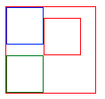
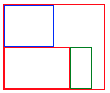
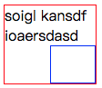

# CSS和文档    
### 替换和非替换元素      
**替换元素**：是指用来替换元素内容的部分并非由文档内容直接表示，如img和input。    
**非替换元素**：是指其内容由用户代理（通常是浏览器）在元素本身生成的框中显示。如段落、标题、列表和表单元格等。     
      
### 块级元素和行内元素     
**块级元素**：块级元素生成一个行内框，（默认的）它会填充父元素的内容区，旁边不能有其他元素。列表项是块级元素的一个特例，它会生成一个标记符，无序列表是一个圆点，有序列表是一个数字。     
**行内元素**：行内元素在一个文本行内生成元素框，而不会打断这行文本。     
在HTML和XHTML中，块级元素不能嵌套在行内元素中，而CSS中没有这种限制。       
        
## 在HTML中使用CSS    
* link标记，称为外部样式表。     
* style元素，称为内部样式表或嵌套样式表。    
* @import    
* 内联样式    

CSS注释用/* */包裹。    
     
         
# 选择器    
### 元素选择器    
### 类选择器     
```
    /*p和warning中间没有空格，这个样式会应用到class为warning的p元素*/
    p.warning {color:red};
```
### ID选择器     
### 属性选择器，有四种类型    
1. 简单属性选择器    
```
    /*选择所有有class属性的p元素，将其文本置为银色*/
    p[class] { color:silver; }

    /*选择所有有class和id属性的p元素，将其文本置为银色*/
    p[class][id] { color:silver; }
```
2. 根据具体属性值选择    
```
    /*选择所有title属性值为w3c的p元素，将其文本置为银色*/
    p[title="w3c"] { color:silver; }
```
3. 根据部分属性值选择    
```
    /*选择所有class属性包含warn的p元素，将其文本置为红色*/
    /*包括class="warn danger"，不包括class="warning "*/
    p[class~="warn"] { color:red; }
```
子串匹配属性选择器      

|类型 | 描述|
|---------|----------|
|[foo~="bar"] | 选择foo属性包含bar的所有元素，以空格分离|
|[foo^="bar"] | 选择foo属性以bar开头的所有元素|
|[foo$="bar"] | 选择foo属性以含bar结尾的所有元素|
|[foo*="bar"] | 选择foo属性包含子串bar的所有元素|
     
4. 特定属性选择器     
        
### 后代选择器    
```
    /*选择后代元素*/
    div p { color: red; }

    /*选择子元素*/
    div>p { color: red; }

    /*选择相邻兄弟元素*/
    h1 + p { color: red; }/*选择紧接在h1后面的p元素*/
```
### 伪类和伪元素    
链接伪类：

|伪类名|描述|
|-----|----|
|:link|指示作为超链接（即有一个href属性）并指向一个未访问地址的所有锚|
|:visited|指示作为已访问地址超链接的所有锚|    
       
动态伪类：

|伪类名|描述|
|-----|----|
|:hover|指示鼠标悬停在哪个元素上|
|:active|指示当前被用户激活的元素|    
      
伪类的顺序为：link=>visited=>focus=>hover=>visited      
      
选择第一个子元素： :first-child。容易引起误解，看下面的例子：     
```
    <style>
        ul:first-child{
            color: red;
        }
    </style>

    <ul>
        <li>haha</li>
        <li>zizi</li>
        <li>xixi</li>
        <li>hehe</li>
    </ul>
```
效果：    
    
```
    <style>
        li:first-child{
            color: red;
        }
    </style>

    <ul>
        <li>haha</li>
        <li>zizi</li>
        <li>xixi</li>
        <li>hehe</li>
    </ul>
```
效果：    
    
由此可以看出，:first-child指的并不是元素的第一个子元素，而是作为子元素的第一个元素。      
      
根据语言选择： :lang(fr)     
伪元素选择器： 
首行和首字母： :first-line，:first-letter
设置之前和之后的元素的样式：:after， :before
```
    body:after{
        content: " The End.";
    }
```
     
# 结构和层叠     
继承时从一个元素向其后代元素传递属性值所采用的机制。确定应当向一个元素应用哪些值时，用户代理不仅要考虑继承，还要考虑声明的特殊性，以及声明本身的来源，这个过程称为**层叠**。层叠主要考虑一下三种机制的相互关联：特殊性、继承和层叠。     
## 特殊性    
对于内联样式，加1000；    
对于选择器中给出的各个ID属性值，加0100；    
对于选择器中给出的各个类、属性或伪类属性值，加0010；    
对于元素和伪元素，加0001；    
结合符和通配选择器对特殊性没有贡献。     
      
重要性：有时候某个声明可能非常重要，超过其他所有声明，则用!**important**标识。如果一个重要声明和一个非重要声明冲突，胜出的总是重要声明。     
       
## 继承    
基于继承机制，样式不仅需要应用到指定元素，还会应用到他们的后代元素。     
有些属性是不能继承的，一般来说，大多数框模型属性都不能继承，如内边距、外边距、背景和边框。     
继承的值根本没有特殊性，甚至比通配符*还低。    
     
## 层叠    

# 值和单位    
**px**像素（Pixel）。相对长度单位。像素px是相对于显示器屏幕分辨率而言的。     
**em**是相对长度单位。相对于当前对象内文本的字体尺寸。如当前对行内文本的字体尺寸未被人为设置，则相对于浏览器的默认字体尺寸。    
1. em的值并不是固定的；    
2. em会继承父级元素的字体大小。    

**rem**是CSS3新增的一个相对单位（root em，根em），使用rem为元素设定字体大小时，仍然是相对大小，但相对的只是HTML根元素。    
     

# 字体    
要解决的问题：字体系列(font-family)、字体加粗(font-weight)、字体风格(斜体)、字体变形（小型大写字母）。       
### font-weight
可能的取值：normal|bold|bolder|lighter|100|200|300|400|500|600|700|800|900|inherit，其中400=normal，700=bold。对于数字来说，只要后一个关键字对应的变形不比前一个细，就都是被允许的，例如100，200，300，400可能都映射到相同较细的变形，500，600可能对应到相同较粗的变形，而700，800，900对应到同样很粗的变形。   

### font-size
字体本身有一个em方框，这个方框不一定指示字体中字符建立的任何边界，相反，它指示如果没有额外行距（line-height）设置字体时基线间的距离。某种字体的字符可能比默认基线间的距离要高。font-size的作用就是为给定字体的em框提供一个大小，而不能保证实际显示的字符就是这种大小。 如果值为百分数，则根据从其父元素继承的大小来计算。    

### 风格和变形      
**font-style**可能的取值：italic|oblique|normal|inherit。其中italic和oblique都是斜体，两者的区别在于italic是一种单独的字体，而oblique只是正常字体的倾斜，两者在视觉上通常没有区别。    
**font-variant**可能的取值：small-caps|normal|inherit。      
      
# 文本属性     
文本和字体的区别：文本是内容，而字体用于显示这个内容。字体是文字本身的样式，而文本是相对周围环境的样式。使用文本属性可以控制文本相对于该行余下内容的位置、使其作为下标、加下划线，以及改变大小写等。       
### 缩进和水平对齐    
首行缩进text-indent：可能的取值为<length>|<percentage>|inherit。可以为所有块级元素应用该属性，但是行内元素和替换元素不能应用该属性。      
文字对齐text-align：keneng的取值为left|right|center|justify（两端对齐）|inherit。只应用于块级元素的内联内容。      
### 垂直对齐    
行高line-height:是指文本基线之间的距离，而不是字体的大小，它确定了将各个元素框的高度增加或减少多少。line-height值和字体大小之差就是行间距。文本行中每个元素会根据字体大小生成一个**内容区**。内容区会生成一个**行内框**，若不存在其他因素，这个行内框完全等于该元素的内容区。line-height就是改变行内框高度的因素之一。也就是说，行内框包含了行间距。line-height的值减去font-size除以2就得到了给定元素的**行间距**。一旦给定内容生成了所有的行内框，接下来就会生成**行框**。行框的高度恰好包含最高行内框的顶端和最低行内框的底端。       
line-height的默认值通常是字体大小的1.2倍。     
       
垂直对齐vertical-align：只应用于行内元素和替换元素。可能的取值有：
* baseline：要求元素的基线与父元素的基线对齐。如果一个垂直对齐元素没有基线（img，表单或其他替换元素），则它的底端和父元素的基线对齐。       
* super和sub：分别会使元素的基线相对于父元素的基线升高和降低，但是并不会改变元素的大小。     
* bottom:底端对齐      
* top:顶端对齐     
* middle:往往应用于图像，会将行内元素框的中点与父元素基线上方0.5ex处的一个点对齐。
* 百分数和数字    
     
垂直对齐的文本不会成为另一行的一部分，也不会覆盖其他行中的文本，所有垂直对齐的元素都会影响行高。         
       
### 字间隔和字母间隔    
字间隔word-spacing，可能的取值为<length>|normal|inherit。取正值时会使字间距增大，取负值时缩小。       
字母间隔letter-spacing，可能的取值为<length>|normal|inherit。取正值时会使字母间距增大，取负值时缩小。     
文本转换text-transform，可能的取值：uppercase|lowercase|capitalize（首字母大写）|none（默认）|inherit。       
文本装饰text-decoration,可能的取值为：none|underline|overline（上划线）|line-through（中划线）|blink（闪烁）|inherit。当有多个值时，text-decoration的值会替换而不是累积起来。        

文本阴影text-shadow：已删除。    
处理空白符white-space：默认值为normal，也就是在默认情况下，会将所有空白字符合并为一个空格，换行符也将转换为空格。     
       
文本方向direction，可能的取值为ltr|rtl|inherit。     
      
# 基本视觉格式化     
CSS假定每个元素都会生成一个或多个矩形框，成为元素框。元素框中心有一个内容区，内容区周围有可选的内边距、边框和外边距。      
 
      
 
外边距通常是透明的，从中可以看到父元素的背景。外边距可以为负，内边距则不行。边框的宽度不能为负，不指定颜色时，其颜色为元素内容的前景色。     
### 包含块
包含块由最近的块级祖先框、表单元格或行内块（inline-block）祖先框的内容边界构成。每个元素都相对于其包含块摆放，可以说包含块就是元素的布局上下文。        
     
概念：
* 正常流，从上到下，从左到右显示     
* 非替换元素，元素内容包含在文档中    
替换元素，作为其他内容占位符的元素，如img和大多数表单元素
块级元素，这些元素在正常流中，会在其框之前和之后生成换行，所以处于正常流中的块级元素会垂直摆放。       
行内元素，这些元素不会在之前或之后生成行分隔符，它们是块级元素的后代。
根元素，在HTML中就是指html元素。      
     
## 块级元素
   
一般的，一个元素的width定义为从左内边界到右内边界的距离，height则是从上内边界到下内边界的距离。      
### 水平格式化    
七大水平属性：margin-left,border-left,padding-left,width,padding-right,border-right,margin-right。这七个值之和必然等于元素包含块的宽度，一般是块元素的父元素的width（因为块元素的父元素几乎都是块元素）。      

这七个属性中，有三个可以设置为auto：width和两个margin，其余属性必须有特定值，或者默认为0。        
如果将三个值中某一个设为auto，而余下两个为特定值，那么设置为auto的属性会确定所需的长度，从而使元素框的宽度等于父元素的width。如果三个属性都设置为非auto的某个值，这种情况成为过分受限，此时总会把margin-right强制为auto。       
若将两个margin设为0，则元素会水平居中。若将一个margin和width设为auto，则设置auto的margin会减为0。若三个值都为auto，则两个margin会被设为0。         
以上是非替换块级元素的布局规则，同样也适用于替换块级元素（如将img的display设为block），唯一的不同在于：如果width为auto，则元素的宽度是内容的固有宽度。       
### 垂直格式化    
块级元素的默认高度由其内容决定。可以对任何块级元素设置显式高度。当指定高度大于内容高度，会出现一个视觉效果，好像有一个额外的内边距一样。反之，当指定高度小于内容高度，浏览器可能会向元素增加一个滚动条。具体取决于overflow属性的值。       
垂直方向同样也有七个属性，这七个属性值之和必须等于元素包含块的height。有三个值可以设为auto：height，margin-top和margin-bottom。      
若将一个元素的上下外边距设置为auto，实际上它们都会被重置为0。      
相邻垂直外边距会沿着竖轴合并。       
如果负外边距导致两个元素重叠，那么文档中后出现的元素会覆盖在较早出现的元素之上。    
       
## 行内元素    
概念：    
* 匿名文本：指所有没有包含在行内元素中的字符串，包括空格。     
* em框：也成为字符框，在字体中定义。实际字形可能比em框更高或者更矮。      
* 内容区：非替换元素中的内容框可能有两种，可能是各个字符的em框串在一起构成的框，也可能是由元素中字符字形描述的框。替换元素的内边距就是元素的固有高度加上可能有的外边距、边框和内边距。      
* 行间距：font-size值和line-height值之差。这个差要分为两半，分别应用到内容区的顶部和底部。行间距只应用于非替换元素。      
* 行内框：内容区加行间距。对于非替换元素，行内框高度等于line-height值；对于替换元素，行内框高度等于内容区的高度，因为行间距不应用到替换元素。      
* 行框：包含该行中出现的行内框的最高点和最低点的最小框。        
### 行内格式化      
line-height实际上只影响行内元素及其他行内内容，而不影响块级元素，至少不会直接影响块级元素。可以为一个块级元素设置line-height值，但是这个值只有在应用到块级元素的内联内容时才会有视觉影响。      
对于**行内非替换元素**或**匿名文本**，font-size决定了其**内容区**的高度。line-height与font-size只差的1/2分别应用到内容区的顶部和底部，就得到了**行内框**。文本都是按基线对齐的，行框定义为行中最高行内框的顶端到最低行内框的底端的距离，而且各行框的顶端挨着上一行行框的底端。       
行内框的边框由font-size而不是line-height决定，也就是说，边框包含的是内容区。    
若为行内元素指定内边距，会影响行内框的高度，但是不会影响内容区的形状。类似的，向一个行内元素增加边框也不会影响行框的生成和布局。外边距不会应用到行内元素的顶端和底端，它们不影响行框的高度。        
对于**行内替换元素**，会用替换元素整体（包括内容、外边距、边框和内边距）来定义行内框。因此插入内外边距会影响替换元素的行内框，从而影响行框高度。       
默认的，行内替换元素位于基线上，但是替换元素没有自己的基线，所以相对来讲最好的办法就是将其行内框的底端与基线对齐。因此，实际上是下外边距边界与基线对齐。      
可以通过display来设置元素的显示方式，但是该属性改变的只是元素的显示角色，而不是其本质。也就是说，让一个段落生成行内框并不能把这个段落变成真正的行内元素。例如行内元素可以使块级元素的后代，但是反过来则不行，因此链接可以放在段落中，但是反过来则不行。    
对于行内块元素（inline-block），它会作为一个替换元素放在行中，而在其内部，会像块级元素一样设置内容的格式。      
块级元素、行内替换元素和行内块元素可以设置width和height属性。若行内块元素没有定义width或定义为auto，元素框会收缩以适应内容。        

# 内边距、边框和外边距    
元素的width被定义为从其左内边界到其右内边界的距离，height被定义为从其上内边界到其下内边界的距离。这两个属性不能应用到行内非替换元素。如果对一个行内非替换元素声明width或height属性，浏览器必须忽略这些声明。      
背景会延伸到内边距中，但是不会应用的外边距。     
将margin设为百分数时，其大小是根据父元素的width计算的。       
正常流中垂直相邻的外边距会合并。     
上下外边距对行内非替换元素无效，而左右外边距有效。      
       
border必须指定border-style，否则它的宽度会被重置为0。       
不论行内元素指定怎样的宽度，其行高都不会变。但是这些只对元素的上下边成立，对于左右边，不仅该边框可见，而且文本会在其旁显示（即不会覆盖）。   

```
    span{
        border: 12px solid rgba(255, 0, 0, 0.2);
    }
```

效果为：     
      
      
当使用百分数时，上下内边距和左右内边距一样是相对父元素的宽度计算，而不是高度。    
对于行内非替换元素，若对左右内边距设置了值，左右内边距将是可见的。上下内边距也不会改变行高。     
     
```
    span{
        padding: 12px;
        background-color: rgba(255, 0, 0, 0.2);
    }
```

效果为：     
        
        
# 颜色和背景    
### 前景色
对于非替换元素，前景色设置了元素中文本的颜色。边框的默认颜色也是前景色。前景色可以继承。      
### 背景色background-color    
前景色可以继承，背景色不可以继承。      
背景包括前景之下直到边框外边界的所有空间。       
### 背景图片background-image     
默认值为none，可以向任何元素使用背景图片。所有背景属性都不能继承，背景图片也是如此。背景图片在背景颜色之上。      
### 有方向的重复      
background-repeat：repeat|repeat-x|repeat-y|no-repeat|inherit。    
### 背景定位    
background-position,应用于块级元素和替换元素。可取的值有百分数，数值，center，top，bottom，right，left。可以使用两个关键字，分别代表水平方向和垂直方向。当只有一个关键字时，center=center center，等价于50% 50%；top=top center||center top，等价于50% 0%；bottom=bottom center||center bottom等价于50% 100%；right=right center||center right，等价于100% 50%；left=left center||center left，等价于0 50%。      
### 关联
background-attachment，可能的取值为:scroll（默认，图像随文本滚动）|fixed（图像不随文本滚动）|inherit。      
设为fixed的背景图，大小由可视区而不是包含元素的大小决定，定位也是相对于可视区域而不是包含元素。     
### 汇总   
background:可以从各个其他背景属性取一个值，可以采用任何顺序。      
[< background-color >||< background-image >||< background-repeat >||< background-attachment >||< background-position >]|inherit。       
如果省略了某个属性，就会默认填入这个属性的默认值。       
      
# 浮动和定位     
## 浮动   
任何元素都能设置浮动。浮动会以某种方式将元素从文档中删除，但是它还是会影响布局；一个元素浮动时，其他元素会环绕该元素；浮动元素周围的外边距不会合并。     
**包含块**：浮动元素的包含块是指其最近的块级祖先元素。    
浮动元素会生成一个块级框，而不管这个元素本身是什么。    
**浮动规则**：    
* 浮动元素的左（或右）边界不会超过其包含元素的左（或右）边界。    
* 浮动元素的左（或右）边界必须是源文档中之前出现的左浮动元素（或右浮动元素）的右（或左）边界，除非后出现的浮动元素的顶端在先出现的浮动元素的底端下面。这保证了浮动元素不会相互覆盖。    
```
.container {
    width: 100px;
    position: relative;
    overflow: hidden;
    margin: 32px;
    border: 1px solid red;
}

.container div {
    width: 40px;
    height: 40px;
    float: left;
}

.div1 {
    border: 1px solid blue;
}

.div2 {
    margin-top: 12px;
    border: 1px solid red;
}

.div3 {
    border: 1px solid green;
}

<div class="container">
    <div class="div1"></div>
    <div class="div2"></div>
    <div class="div3"></div>
</div>
```

* 左浮动元素的右边界不会在其右边右浮动元素的左边界的右边，反之亦然。这保证了浮动元素不会相互覆盖。    
* 浮动元素的顶端不能比其父元素的内顶端更高。    
* 浮动元素的顶端不能比之前所有浮动元素或块级元素的顶端更高。   
```
.container {
            width: 100px;
            position: relative;
            overflow: hidden;
            margin: 32px;
            border: 1px solid red;
        }

        .container div {
            height: 40px;
            float: left;
        }

        .div1 {
            width: 48px;
            border: 1px solid blue;
        }

        .div2 {
            width: 64px;
            border: 1px solid red;
        }

        .div3 {
            width: 20px;
            border: 1px solid green;
        }
```
     
* 如果源文档中一个浮动元素之前出现另一个元素，浮动元素的顶端不能比包含该元素所生成框的任何行框的顶端跟更高。     
```
    .container div {
        height: 40px;
        float: right;
    }

    .div1 {
        width: 48px;
        border: 1px solid blue;
    }
    <div class="container">
        <span>soigl kansdf ioaersdasd</span>
        <div class="div1"></div>
    </div>
```
  
* 浮动元素不能超过其包含元素的边界，除非它太宽，本身都无法放下。    
* 浮动元素必须尽可能高的放置。    
* 左浮动元素必须向左尽可能远，右浮动元素必须向右尽可能远。位置越高，就会向左或者向右浮动得更远。       
        
## 定位
position:static|relative|absolute|fixed|inherit      
static:默认值。元素框正常生成。块级元素生成一个矩形框，作为文档流的一部分，行内元素则会生成一个或多个行框，至于其父元素中。    
relative：相对于自身偏移某个距离。元素仍保持其未定位前的形状，它原本所占有的空间仍然保留。    
absolute：元素框从文档流中被完全删除，并相对于其包含块定位。    
fixed：类似于absolute，不过其包含块是视窗本身。    
**包含块**：被看做是“定位上下文”，分为以下几种情况：
* 对于根元素，其包含块由用户代理建立。大多数为视窗大小的矩形；    
* 对于非根元素，若position为relative或static，其包含块为离其最近的块级框、表单元格或行内块祖先框的内容边界构成；若position为absolute，包含块为最近的position不为static的祖先元素（可以是任意类型）。      
定位的偏移属性定义了距离相应包含块**边**的距离，而不是左上角的偏移。若果用top、right、bottom和left描述四个边的位置，那么元素的宽度和高度将由这些偏移隐含决定。此时设置width和height属性可能会（没有内外边界时）无效。    
### 内容溢出和剪裁    
overflow：visible|hidden|scroll|auto|inherit    
* visible：默认值，元素内容在元素框之外也可见。     
* hidden：元素的内容会在元素边界处被剪裁，不会提供滚动接口使用户访问超出剪裁区域的内容。     
* scroll：元素内容在元素边界处被剪裁，出现滚动条。    
* auto：由用户代理决定采取哪种行为。    
**内容剪裁**：clip，对绝对定位元素有效，可能的取值为rect(tio,right,bottom,left)|auto|inherit。
对position为absolute的块级元素，将其上下外边距设为auto且top、bottom为0可得到相对于包含块**垂直**居中的效果。      
    
# 表布局     
内部表元素生成矩形框，这些框有内容、内边距和边框，但是没有外边距。试图对单元格、行或其他任何内部表元素应用外边距，浏览器会将其忽略。     
表显示中使用的格式化层，从上到下依次是：单元格，行，行组，列，列组，表。基本来说，对应表各个方面的样式都在其各自层上绘制。上一层的背景会覆盖下一层。但是默认所有元素背景都是透明的。因此，如果上一层没有背景，那么下一层的背景就会透过上一层的元素可见。     
### 表标题
caption-side：可能的取值为top和bottom，这时标题会分别位于表的顶部和底部。caption元素会从table继承属性。      
### 表单元格边框     
border-collapse：可能的取值为collapse，separate或inherit。        
border-collapse属性为separate时，可以指定其边框间隔，使用border-space属性，可能的取值为< length >< length >|inherit。    
### 对齐
水平对齐：text-align      
垂直对齐：vertical-align，可能的取值为：top|bottom|middle|baseline。   
# 列表与生成内容    
列表中的项会生成块级框，不过一般的块级框多了一个部分，多出的部分不属于文档布局，而只是挂在一边。对于有序列表，它是一个数字；对于无序列表，它是一个点。   
### 列表类型 
list-style-type：用于修改列表项的标志类型。可能的取值有：disc（实心圆），circle（空心圆），square（方块），decimal（数字），upper-alpha（A, B C...），none等等。     
list-style-image：列表项图像，可能的取值为：< uri >|none|inherit。   
list-style-position：列表标志位置。可能的取值为outside（默认），inside和inherit。      
以上三个属性可以合并为list-style属性，可以以任何顺序给出。     
## 生成内容
是指由浏览器创建的内容，而不是由标志或内容来表示，如列表标志就是生成内容。   
可以使用:before或:after伪元素向文档中插入生成内容。这些伪元素会根据content属性把生成内容放在一个元素内容的前面或者后面。     
禁止对:before和:after元素使用浮动和定位。另外还有如下限制：    
* 若:before和:after选择器的主体是块级元素，则display属性只接受值none、inline、block和market，其他值都会转成block。     
* 若:before和:after选择器的主体是行内元素，则display属性只接受值none和inline，其他值都会转成inline。     
     
:before和:after中的content的取值可能为字符串和URI等等。     
生成内容从与之关联的元素继承可继承的属性。     
      
# 用户界面样式      

##光标 cursor   
URI|auto|default|pointer|crosshair|move|e-size|ne-size|nw-size|n-resize|se-resize|sw-resize|s-resize|w-resize|text|wait|help|progress|inherit


      
# 杂项
event.screenX、event.screenY    
鼠标相对于用户显示器屏幕左上角的X,Y坐标。标准事件和IE事件都定义了这2个属性     
      
event.clientX、event.clientY       
鼠标相对于浏览器可视区域的X,Y坐标（将参照点改成了浏览器内容区域的左上角），可视区域不包括工具栏和滚动条。IE事件和标准事件都定义了这2个属性    
    
event.pageX、event.pageY    
类似于event.clientX、event.clientY，但它们使用的是文档坐标而非窗口坐标。这2个属性不是标准属性，但得到了广泛支持。IE事件中没有这2个属性。    
    
event.offsetX、event.offsetY        
这两个属性是IE特有的，鼠标相对于“触发事件的元素”的位置（鼠标想对于事件源元素的X,Y坐标）。    
    
window.pageXOffset    
整数只读属性，表示X轴滚动条向右滚动过的像素数（表示文档向右滚动过的像素数）。IE不支持该属性，使用body元素的scrollLeft属性替代。     
    
window.pageYoffset    
整数只读属性，表示Y轴滚动条向下滚动过的像素数（表示文档向下滚动过的像素数）。IE不支持该属性，使用body元素的scrollTop属性替代。     
        
$(selector).offset():返回或设置匹配元素相对于文档的偏移位置。      
      
width() 方法设置或返回元素的宽度（不包括内边距、边框或外边距）。     
height() 方法设置或返回元素的高度（不包括内边距、边框或外边距）。    
       
innerWidth() 方法返回元素的宽度（包括内边距）。     
innerHeight() 方法返回元素的高度（包括内边距）。      
       
outerWidth() 方法返回元素的宽度（包括内边距和边框）。      
outerHeight() 方法返回元素的高度（包括内边距和边框）。      
      
outerWidth(true) 方法返回元素的宽度（包括内边距、边框和外边距）。      
outerHeight(true) 方法返回元素的高度（包括内边距、边框和外边距）。      
      
### event对象

|属性|描述|
|----|----|
|altKey|返回当事件被触发时，”ALT” 是否被按下。|
|button|返回当事件被触发时，哪个鼠标按钮被点击。|
|clientX|返回当事件被触发时，鼠标指针的水平坐标。|
|clientY|返回当事件被触发时，鼠标指针的垂直坐标。|
|ctrlKey|返回当事件被触发时，”CTRL” 键是否被按下。|
|metaKey|返回当事件被触发时，”meta” 键是否被按下。|
|relatedTarget|返回与事件的目标节点相关的节点。|
|screenX|返回当某个事件被触发时，鼠标指针的水平坐标。|
|screenY|返回当某个事件被触发时，鼠标指针的垂直坐标。|
|shiftKey|返回当事件被触发时，”SHIFT” 键是否被按下。|
||
        

IE属性(除了上面的鼠标/事件属性，IE 浏览器还支持下面的属性)

|属性|描述|
|----|----|
|cancelBubble|如果事件句柄想阻止事件传播到包容对象，必须把该属性设为 true。|
|fromElement|对于 mouseover 和 mouseout 事件，fromElement 引用移出鼠标的元素。|
|keyCode|对于 keypress 事件，该属性声明了被敲击的键生成的 Unicode 字符码。|
|offsetX,offsetY|发生事件的地点在事件源元素的坐标系统中的 x 坐标和 y 坐标。|
|returnValue|如果设置了该属性，它的值比事件句柄的返回值优先级高。|
|srcElement|对于生成事件的 Window 对象、Document 对象或 Element 对象的引用。|
|toElement|对于 mouseover 和 mouseout 事件，该属性引用移入鼠标的元素。|
x,y|事件发生的位置的 x 坐标和 y 坐标，它们相对于用CSS动态定位的最内层包容元素。|
||

      

标准 Event 属性 下面列出了 2 级 DOM 事件标准定义的属性。

|属性和方法|描述|
|---|----|
|bubbles|返回布尔值，指示事件是否是起泡事件类型。|
|cancelable|返回布尔值，指示事件是否可拥可取消的默认动作。|
|currentTarget|返回其事件监听器触发该事件的元素。|
|eventPhase|返回事件传播的当前阶段。|
|target|返回触发此事件的元素（事件的目标节点）。|
|timeStamp|返回事件生成的日期和时间。|
|type|返回当前 Event 对象表示的事件的名称。|
|initEvent()|初始化新创建的 Event 对象的属性。|
|preventDefault()|通知浏览器不要执行与事件关联的默认动作。|
|stopPropagation()|不再派发事件。|  
||
     
         
### Event对象的一些兼容性写法
* 获得event对象兼容性写法     
event || (event = window.event);
* 获得target兼容型写法     
event.target||event.srcElement
* 阻止浏览器默认行为兼容性写法     
event.preventDefault ? event.preventDefault() : (event.returnValue = false);
* 阻止冒泡写法     
event.stopPropagation ? event.stopPropagation() : (event.cancelBubble = true);
* 注册和删除事件方法的形式    
```
// 绑定事件.
function on(id, eventType, fn) {
    var dom = this.isString(id) ? this.$id(id) : id;
    if(dom.addEventListener) {
        dom.addEventListener(eventType, fn);
    } else {
        if(dom.attachEvent) {
            dom.attachEvent('on' + eventType, fn);
        }
    }
},

// 解除绑定
function un(id, eventType, fn) {
    var dom = this.$id(id);
    if(dom.removeEventListener) {
        dom.removeEventListener(eventType, fn, false);
    } else {
        if(dom.detachEvent) {
            dom.detachEvent("on" + eventType, fn)
        }
    }

}
```
     
jquery鼠标事件汇总     

|事件|说明|
|---|---|
|click事件|点击鼠标左键时触发|
|dbclick事件|迅速连续的两次点击时触发|
|mousedown事件|按下鼠标时触发|
|mouseup事件|松开鼠标时触发|
|mouseover事件|鼠标从一个元素移入另一个元素时触发|
|mouseout事件|鼠标移出元素时触发|
|mouseenter事件|鼠标移入元素时触发|
|mouseleave事件|鼠标移出元素时触发|
|hover||
|toggle事件|鼠标点击切换事件| 
||
     


