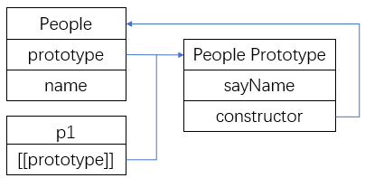

想要理解js的继承，先要理解构造函数、原型对象和实例对象三者之间的关系：构造函数上有一个prototype属性，指向原型对象；反过来，原型对象上有一个constructor属性，指向构造函数；当调用构造函数创建一个新实例后，该实例内部会包含一个指针，指向构造函数的原型对象，ES5规定这个指针叫[[prototype]]。看下面的例子：
```
function People(name){
    this.name = name;
}

People.prototype.sayName = function(){
    console.log(this.name);
}

var p1 = new People('Lucy');
p1.sayName();
```        
构造函数、原型对象和实例对象三者之间的关系如下图所示：           
                  
## 原型模式               
不难想到，实现继承的第一种方式：让原型对象等于另一个类型的实例。
```
function Student(grade){
    this.grade = grade;
    this.courses = [];
}

Student.prototype = new People(); //1
Student.prototype.sayCourses = function(){
    console.log(courses);
}
```               
这样，当我们实例化一个student对象时，它的原型对象就指向了在代码(1)处实例化的People的实例对象，当调用student对象的name属性或sayName方法时，实际上会调用它的原型对象上的name和sayName，从而实现了继承。           
这里我们直接用People的一个实例对象将Student的prototype属性给覆盖了。如前面所说，构造函数Student的prototype属性指向原型对象，这个原型对象上本来是有一个constructor属性指向构造函数Student的，但是这样直接覆盖的同时，将原型对象上的constructor属性也覆盖了。因此，通常会在代码(1)下面加上一句：     
```
function People(name){
    this.name = name;
}

People.prototype.sayName = function(){
    console.log(this.name);
}

function Student(grade){
    this.grade = grade;
}

Student.prototype = new People(); //1
Student.prototype.constructor = People; //2
Student.prototype.sayCourses = function(){
    console.log(courses);
}
```       
上面的代码实现了继承。但是这种方式有没有什么问题呢？           
第一个问题很明显，就是在创建student的实例对象时，无法向构造函数里面传参来初始化name属性。        
第二个问题比较隐蔽，看下面的代码：            
```
function People(name){
    this.name = name;
    this.favirateFood = [];
}

People.prototype.sayFavirateFood = function(){
    console.log(this.favirateFood);
}

function Student(grade){
    this.grade = grade;
}

Student.prototype = new People(); //1
Student.prototype.constructor = People; //2
Student.prototype.sayCourses = function(){
    console.log(courses);
}

var s1 = new Student(1);
s1.favirateFood.push('rice');
s1.sayFavirateFood(); //["rice"]

var s2 = new Student(2);
s2.sayFavirateFood(); //["rice"]
```     
上面代码通过实例化Student得到两个对象s1和s2，改变s1的favirateFood属性，调用s2的sayFavirateFood方法，可以看到s2的favirateFood也发生了改变，这是为什么呢？               
因为favirateFood属性是挂在Student.prototype原型对象上的一个引用类型值，这个值是被所有实例对象所共享的。因此改变其中一个实例对象的该属性，其他实例对象的该属性也会发生改变。这也是为什么在定义构造函数时会将属性写在构造函数里面而不写在prototype上面。          
## 原型式继承          
这种继承方法，跟上面讲到的方法原理上差不多，只是更加简洁：    
```
function object(o){
    function F(){};
    F.prototype = o;
    return new F();
}
```
缺点也是跟上一个方法类似。这种继承方式优点是比较简洁，不用创建太多构造函数，在只想让一个对象和另一个对象保持类似的情况下，用这种方法就够了。          
## 寄生式继承
```
function createObject(o){
    var clone = Object(o);
    clone.sayHi = function(){
        console.log('Hi...);
    }
    return clone;
}
```
思路很简单，就是创建一个仅用于封装继承过程的函数，该函数以某种方式来增强对象，然后将增强后的对象返回。它的缺点也很明显，每一个对象上都有一个sayHi方法，代码复用性较差。      
## 借用构造函数             
由于基于原型的继承的以上缺点，所以开发人员开始使用借用构造函数的技术，其基本思想很简单：在子类型构造函数的内部调用超类型构造函数。            
```
function People(name){
    this.name = name;
}

People.prototype.sayName = function(){
    console.log(this.name);
}

function Student(grade, name){
    People.call(this, name);
    this.grade = grade;
}

Student.prototype.sayGrade = function(){
    console.log(this.grade);
}

var s = new Student(1, 'Lily');
s.sayGrade(); //1
s.sayName(); //Uncaught TypeError: s.sayName is not a function
```
可以看到，在调用sayName方法时报错了，也就是说在超类原型上定义的方法，在子类中是不可见的。要想在子类中调用该方法，只能将该方法定义在超类的构造函数里面：           
```
function People(name){
    this.name = name;
    this.sayName = function(){
        console.log(this.name);
    }
}
```
但是这样一来，每创建一个实例对象，这个方法就会被赋值一遍，代码复用就无从说起了。             
## 组合继承     
既然基于原型的继承和基于构造函数的继承都有一些缺陷，那么能不能将二者结合起来呢？这就是组合继承。看下面的代码：    
```
function People(name){
    this.name = name;
    this.favirateFood = [];
}

People.prototype.sayFavirateFood = function(){
    console.log(this.favirateFood);
}

function Student(grade, name){
    People.call(this, name);//1
    this.grade = grade;
}

Student.prototype = new People(); //2
Student.prototype.constructor = People; //3
Student.prototype.sayCourses = function(){
    console.log(courses);
}

var s1 = new Student(1, 'Lucy');
s1.favirateFood.push('rice');
s1.sayFavirateFood(); //["rice"]

var s2 = new Student(2, 'Lily');
s2.sayFavirateFood(); //[]
```
代码(1)继承了超类中的属性，代码(2)继承超类原型链上的方法，代码(3)将constructor还原。这样结合了基于原型的继承和基于构造函数的继承二者的优点，功能上堪称完美？          
但是它有没有缺陷呢？          
当然有。看代码(1)和代码(2)，超类的构造函数被执行了两次，实际上，超类中的属性会被复制一遍，重新挂在子类上，调用子类构造函数时会覆盖父类的这些属性。               
## 寄生组合式继承
仔细分析上面组合继承的代码，不难发现第二次调用超类的构造函数（代码(2)）目的是将超类原型上的方法复制到子类的原型上。明白了这一点，就可以不用在这里调用超类的构造函数，而直接复制其原型对象了。            
```
function inheritPrototype(subType, superType){
    var prototype = superType.prototype;
    prototype.constructor = subType;
    subType.prototype = prototype;
}
```
然后，我们将组合继承的代码稍作改动：
```
function People(name){
    this.name = name;
    this.favirateFood = [];
}

People.prototype.sayFavirateFood = function(){
    console.log(this.favirateFood);
}

function Student(grade, name){
    People.call(this, name);//1：继承属性
    this.grade = grade;
}

inheritPrototype(Student, People);//2：继承原型

Student.prototype.sayCourses = function(){
    console.log(courses);
}

var s1 = new Student(1, 'Lucy');
s1.favirateFood.push('rice');
s1.sayFavirateFood(); //["rice"]

var s2 = new Student(2, 'Lily');
s2.sayFavirateFood(); //[]
```
这种方法的优势是，只调用了一次超类的构造函数，并且避免了在子类的原型链上创建多于的属性，同时，它又能保持子类的原型链不变，可以说是一种最理想的继承方式。           