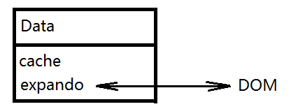

# 架构
## 整体架构   
```
;(function(global, factory){
    factory(global);
}(typeof window !== undefined ? window : this, function(window, noGlobal){
    var jQuery = function(selector, context){
        return new jQuery.fn.init(selector, context);
    };
    jQuery.fn = jQuery.prototype = {};
    // 核心方法
    // 回调系统
    // 异步队列
    // 数据缓存
    // 队列操作
    // 选择器
    // 属性操作
    // 节点遍历
    // 文档处理
    // 样式操作
    // 属性操作
    // 事件系统
    // AJAX交互
    // 动画引擎
}));
```
五大块：**选择器**、**DOM操作**、**事件**、**AJAX**与**动画**。    
     
## jQuery中的类数组对象    
为什么jQuery选择器得到的对象能够像数组一样操作，通过get方法或下标索引能够转化成DOM对象？
```
var aQuery = function(selector){
    if(!(this instanceof aQuery)){
        return new aQuery(selector);
    }
    var elem = document.getElementById(/[^#].*/.exec(selector)[0]);
    this.length = 1;
    this[0] = elem;
    this.context = document;
    this.selector = selector;
    this.get = function(num){
        return this[num];
    }
    return this;
}
```   
     
## ready与load    
文档加载步骤：    
```
（1） 解析HTML结构；
（2） 加载外部脚本和样式表文件；    
（3） 解析并执行脚本代码；
（4） 构造HTML DOM模型； //ready
（5） 加载图片等外部文件；
（6） 页面加载完毕。 //load
```            
     
## 无冲突处理    
```
var _jQuery = window.jQuery,
    _$ = window.$;

jQuery.noConflict = function(deep){
    if(window.jQuery === jQuery){
        window.$ = _$;
    }
    if(deep && window.jQuery === jquery){
        window.jQuery = _jQuery;
    }

    return jQuery;
}
```
    
# 核心模块   
## 构建jQuery对象   
```
var $jQuery = function(selector, context){
    return new $jQuery.fn.init(selector, context);
}

$jQuery.fn = $jquery.prototype = {
    constructor: $jQuery,
    init: function(){
        return this;
    },
    jQuery: version,
    ...
}
```      

## 静态方法与实例方法共享   
jQuery中有些方法即可作为实例方法，又可作为静态方法，例如each：
```
$('div').each();
$.each();
```
在jQuery中的实现为：
```
jQuery.prototype = {
    each: function(callback, args){
        retutn jQuery.each(this, callback, args);
    }
}
```
可以看到，实例方法实际上是调用了静态方法。静态方法和实例方法是共享的。         
静态方法挂在jQuery的构造器上，那么实例方法挂在哪里呢？    
jQuery通过new原型上的init方法，也就是将init当做构造器，那么init的原型链方法就是实例方法了。因此，jQuery通过2个构造器划分了两种不同的调用方式，一种是静态，一种是原型（实例）。        
那么如何做到静态方法和实例方法共享呢？      
jQuery通过原型传递解决问题，把jQuery的原型传递给jQuery.prototype.init.prototype。换句话说jQuery的原型对象覆盖了init构造器的原型对象，因为是引用传递所以不需要担心这个循环引用的性能问题。      
```
jQuery.fn.init.prototype = jQuery.fn;
```
给一个例子：     
```
var $ = function(a){
    return new $.prototype.init(a);
}

//静态方法
$.sayHello = function(args){
    if(args)
        console.log("Hello,"+"I am "+args);
    else
        console.log("Hello");
}

$.prototype = {
    init:function(a){
        this.a = a;
    },
    constructor:$,
    //实例方法
    sayHello:function(){
        //实例方法中调用静态方法
        return $.sayHello(this.a);
    },
    a:null
}

$.prototype.init.prototype = $.prototype;

$.sayHello();
$('Jose').sayHello();
```    
     
## 插件接口的设计    
jQuery的插件分为两种： 
1. 挂在jQuery命名空间下的全局函数，也就是静态方法；
2. jQuery对象级别的方法，即挂在jQuery原型下的方法，jQuery对象的实例也可以使用该方法。     
     
jQuery提供的接口为：$.extend(target, [object1], [objectN])。    
接口的使用为：     
```
jQuery.extend({
    data:function(){},
    removeData:function(){}
})

jQuery.fn.extend({
    data:function(){},
    removeData:function(){}
})
```   
jQuery源码中，jQuery.extend和jQuery.fn.extend是指向同一个方法的不同引用。二者调用时上下文不同：
```
jQuery.extend调用的时候上下文指向的是jQuery构造器
jQuery.fn.extend调用的时候上下文指向的是jQuery构造器的实例对象
```      
extend方法的简单实现如下：
```
jQuery.extend = jQuery.fn.extend = function(){
    var options, copy, 
        i = 1, 
        length = arguments.length,
        target = arguments[0];

    //如果只有一个参数，则是对jQuery本身的扩展
    if( i === length){
        target = this;
        i--;
    }

    for(; i<length; i++>){
        if((options = arguments[i]) != null){
            for(var name in options){
                copy = options[name];
                //覆盖拷贝
                target[name] = copy;
            }
        }
    }

    return target;
}
```
    
## 回溯
每个jQuery对象都有三个属性：context、selector和preObject。jQuery中维护着一个对象栈，每个遍历方法都会找到一组新元素，将这组元素推入到栈中。preObject属性就指向这个对象栈中的前一个对象。     
      
## end与addBack      
返回对象栈中的上一个对象。     
```
end: function(){
    return this.preObject || this.constructor(null);
}
```              
             
## 仿栈与队列的操作    
```
//分别处理num为null、为负数、为正数的情况
get: function(num){
    return num != null ?
        (num < 0 ? this[num + this.length] : this[num]) : 
        slice(this);
}

first: function(){
    return this.eq(0);
}

last: function(){
    return this.eq(-1);
}
```
     
## get与eq    
get返回一个DOM对象，eq返回一个jQuery对象。
```
eq: function(i){
    var len = this.length,
        j = +i + (i<0 ? len : 0);
    return this.pushStack(j >= 0 && j < len ? [this[j]] : [])
}

slice: function() {
    return this.pushStack( slice.apply( this, arguments ) );
}
```    
     
## jQuery的each迭代器    
可以作为静态方法和实例方法使用。
```
//实例方法直接调用静态方法
each: function(callback, args){
    return jQuery.each(this, callback, args);
}

//静态方法
each: function(obj, callback, args){
    var value,
        i = 0,
        length = obj.length;
        isArray = isArraylike(obj);

    if (args){
        if (isArray){
            for(; i < length; i++){
                value = callback.apply(obj[i], args);
                if(value === false){
                    break;
                }
            }
        } else{
            for(i in obj){
                value = callback.apply(obj[i], args);
                if(value === false){
                    break;
                }
            }
        }
    }
}
```
    
# 回调
## 理解回调    
```
理解回调函数最重要的2点：
1. 一个回调函数作为参数传递给另一个函数是，我们仅仅传递了函数定义。我们并没有在参数中执行函数。我们并不传递像我们平时执行函数一样带有一对执行小括号()的函数；
2. 回调函数并不会马上被执行，它会在包含它的函数内的某个特定时间点被“回调”。
```
     
## jQuery的回调对象     
jQuery.Callbacks对象使用了发布订阅模式，一般开发者很难用到，主要是提供给jQuery内部的其他模块使用，如$.ajax和$.Deferred。    
```
function foo(){ console.log('Foo') };
function bar(){ console.log('Bar') };

var callbacks = $.Callbacks();
callbacks.add(foo);
callbacks.add(bar);
callbacks.fire();
```    
$.Callbacks对象还可以接受once、memory、unique、stopOnFalse等四个option进行一些特殊的控制。    
     
## $.Callbacks对象的实现    
$.Callbacks对象的接口列表：    
```
callbacks.add()        ：回调列表中添加一个回调或回调的集合。
callbacks.disable()    ：禁用回调列表中的回调。
callbacks.disabled()   ：确定回调列表是否已被禁用。 
callbacks.empty()      ：从列表中删除所有的回调。
callbacks.fire()       ：用给定的参数调用所有的回调。
callbacks.fired()      ：访问给定的上下文和参数列表中的所有回调。 
callbacks.fireWith()   ：访问给定的上下文和参数列表中的所有回调。
callbacks.has()        ：确定列表中是否提供一个回调。
callbacks.lock()       ：锁定当前状态的回调列表。
callbacks.locked()     ：确定回调列表是否已被锁定。
callbacks.remove()     ：从回调列表中的删除一个回调或回调集合。
```    
$.Callbacks对象的源码结构：   
```
jQuery.Callbacks = function(options){
    options = typeof options === 'string' ? 
        (optionsCache[options] || createOptions[options]) : 
        jQuery.extend({}, options);

    fire = function(){};

    self = {
        add: function() {},
        remove: function() {},
        has: function(fn) {},
        empty: function() {},
        disable: function() {},
        disabled: function() {},
        lock: function() {},
        locked: function() {},
        fireWith: function(context, args) {},
        fire: function() {},
        fired: function() {}
    };

    return self;
}

var optionsCache = {};
var rnotwhite = (/\S+/g);

function createOptions(options) {
  var object = optionsCache[options] = {};
  jQuery.each(options.match(rnotwhite) || [], function(_, flag) {
    object[flag] = true;
  });
  return object;
}
```    
主要分为三个部分：   
1. Options参数存储；
2. 内部fire触发器；
3. 外部          
     
## once的实现    
```
function Callbacks(options){
    var list = [],
        self;
    self = {
        add: function(fn){
            list.push(fn);
        },
        fire: function(args){
            if(list){
                list.forEach(function(fn){
                    fn(args);
                });

                if(options === 'once'){
                    list = undefined;
                }
            }
        }
    }
    return self;
}
```
          
## unique的实现
```
function Callbacks(options) {
  var list = [];
  var self;
  var firingStart;
  var memory;

  function _fire(data) {
    memory = options === 'memory' && data;
    firingIndex = firingStart || 0;
    firingStart = 0;
    firingLength = list.length;
    for (; list && firingIndex < firingLength; firingIndex++) {
      list[firingIndex](data);
    }
  }

  self = {
    add: function(fn) {
      var start = list.length;
      if (options == 'unique') {
        if (-1 === list.indexOf(fn)) {
          list.push(fn)
        }
      } else {
        list.push(fn)
      }
      if (memory) {
        firingStart = start; //获取最后一值
        _fire(memory);
      }
    },
    fire: function(args) {
      if (list) {
        _fire(args)
      }
    }
  }
  return self;
}
```    
    
## stopOnFalse的实现    
stopOnFalse: 当一个回调返回false 时中断调用。
```
function Callbacks(options) {
  var list = [];
  var self;
  var firingStart;
  var memory;

  function _fire(data) {
    memory = options === 'memory' && data;
    firingIndex = firingStart || 0;
    firingStart = 0;
    firingLength = list.length;
    for (; list && firingIndex < firingLength; firingIndex++) {
      if (list[firingIndex](data) === false && options === 'stopOnFalse') {
        break;
      }
    }
  }

  self = {
    add: function(fn) {
      var start = list.length;
      if (options == 'unique') {
        if (-1 === list.indexOf(fn)) {
          list.push(fn)
        }
      } else {
        list.push(fn)
      }
      if (memory) {
        firingStart = start; //获取最后一值
        _fire(memory);
      }
    },
    fire: function(args) {
      if (list) {
        _fire(args)
      }
    }
  }
  return self;
}
```    
    
# 数据缓存    
## JavaScript内存泄漏
引起JavaScript内存泄漏的常见原因：   
1. 循环引用
2. 闭包
3. DOM插入     
     
多数内存泄漏由DOM操作引起，含有DOM对象的循环引用将导致当前主流浏览器内存泄漏。    
```
//多个对象循环引用
var a = new Object;
var b = new Object;

a.r = b;
b.r = a;

//循环中引用自己
var a = new Object;
a.r = a;
```
所以这里的总结：     
 ☑  JS的内存泄露，无怪乎就是从DOM中remove了元素，但是依然有变量或者对象引用了该DOM对象。然后内存中无法删除。使得浏览器的内存占用居高不下。这种内存占用，随着浏览器的刷新，会自动释放。     
 ☑  而另外一种情况，就是循环引用，一个DOM对象和JS对象之间互相引用，这样造成的情况更严重一些，即使刷新，内存也不会减少。这就是严格意义上说的内存泄露了。     
所以我们必须有一种机制，避免引用数据直接依附在DOM对象上，这样尽量避免内存泄漏的产生。jQuery的缓存系统就很好的解决了这一问题。     
    
## jQuery的缓存系统    
可以将各种数据存储到DOM元素的自定义属性中，这样虽然很方便，但是同时也带来了隐患。给DOM元素添加过多的自定义属性和数据可能会容易引发循环引用，引起内存泄漏，也会带来一定的全局污染的问题。jQuery在之后的改进就独立出了一个“数据缓存”的模块。      
jQuery的事件系统和动画队列都离不开它的缓存系统。jQuery缓存系统的接口为：     
```
//两个参数是取数据，三个参数是存数据
jQuery.data(element, key, value)
.data()
```     
1.jQuery.data()可以实现为dom元素或js对象添加缓存；    
2.$("ele").data()实是对前者的扩展，其目的是可以方便的通过选择器为多个dom元素添加缓存数据。        
    
## jQuery缓存系统的设计思想
jQuery缓存设计的核心是：    
```
数据放在内存中，通过一个映射关系与直接的DOM元素相关联。    
```     
jQuery支持两种数据缓存：    
1. DOM元素：数据缓存在jQuery.cache中     
2. 普通js对象：数据存储在该对象中。       

jQuery在内存上开辟了一个cache对象，所有对于数据的操作无非就是对cache的CURD操作：    
1. 如果是DOM元素，通过分配一个唯一的关联id把DOM元素和该DOM元素的数据缓存对象关联起来，关联id被附加到以jQuery.expando的值命名的属性上，数据存储在全局缓存对象jQuery.cache中。在读取、设置、移除数据时，将通过关联id从全局缓存对象jQuery.cache中找到关联的数据缓存对象，然后在数据缓存对象上执行读取、设置、移除操作。   
2. 如果是Javascript对象，数据则直接存储在该Javascript对象的属性jQuery.expando上。在读取、设置、移除数据时，实际上是对Javascript对象的数据缓存对象执行读取、设置、移除操作。   
3. 为了避免jQuery内部使用的数据和用户自定义的数据发生冲突，数据缓存模块把内部数据存储在数据缓存对象上，把自定义数据存储在数据缓存对象的属性data上。   

所以jQuery在数据缓存的处理抽出一个Data类出来，通过2组不同的实例，分别处理不同的处理类型：
```
var data_priv = new Data();
var data_user = new Data();
```
data_priv是给jQuery内部使用，比如数据对象，queue，Deferred，事件，动画缓存；另一个对象data_user是提供给开发者使用的，比如$.attr()，$.data等等。     
     
## Data类的设计    
Data对象的内部结构：     
1. 先在jQuery内部创建一个cache对象{}, 来保存缓存数据。 然后往需要进行缓存的DOM节点上扩展一个值为expando的属性  
```
function Data(){
    Object.defineProperty(this.cache = {}, 0, {
        get: function(){
            return {};
        }
    });
    this.expando = jQuery.expando + Math.random();
}    
```
expando的值，用于把当前数据缓存的UUID值做一个节点的属性给写入到指定的元素上形成关联桥梁,所以，所以元素本身具有这种属性的可能性很少，所以可以忽略冲突。    
2. 接着把每个节点的dom[expando]的值都设为一个自增的变量id，保持全局唯一性。 这个id的值就作为cache的key用来关联DOM节点和数据。也就是说cache[id]就取到了这个节点上的所有缓存，即id就好比是打开一个房间(DOM节点)的钥匙。 而每个元素的所有缓存都被放到了一个map映射里面，这样可以同时缓存多个数据。    
关联起dom对象与数据缓存对象的一个索引标记，换句话说，先在dom元素上找到expando对应值，也就uid，然后通过这个uid找到数据cache对象中的内。   
3. 所以cache对象结构应该像下面这样：    
```
var cache = {
  "uid1": { // DOM节点1缓存数据，
    "name1": value1,
    "name2": value2
  },
  "uid2": { // DOM节点2缓存数据，
    "name1": value1,
    "name2": value2
  }
  // ......
};
```
每个uid对应一个elem缓存数据，每个缓存对象是可以由多个name value(名值对)对组成的，而value是可以是任何数据类型的。     

 