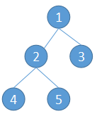
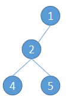
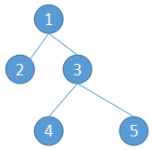

首先介绍一下完全二叉树的定义。除最后一层外，其他各层的节点数都达到最大个数，且最后一层从左向右的叶节点连续存在，只缺右侧若干节点的而二叉树，就是完全二叉树。          
     
如上图所示就是一棵完全二叉树。       
     
上图则不是完全二叉树，因为它不满足“除最后一层外，其他各层的节点数都达到最大个数”的条件。      
     
上图也不是完全二叉树，因为它不满足“最后一层从左向右的叶节点连续存在，只缺右侧若干节点”的条件。      
通过观察可以发现，完全二叉树有如下性质：**编号为k的父节点，其左子节点的编号为2k，右子节点的编号为2k+1；编号为k的节点，其父节点的编号为k/2，取整数部分。**      
正因为完全二叉树有这样的性质，所以我们可以用一个数组来存储它。例如最上面的那棵树，可以存储为[1,2,3,4,5]，节点2和节点3的父节点为节点1，节点4和节点5的父节点为节点2。    
### 最小堆
堆是一种特殊的完全二叉树。最小堆就是所有父节点都比其子节点小的平衡二叉树。
